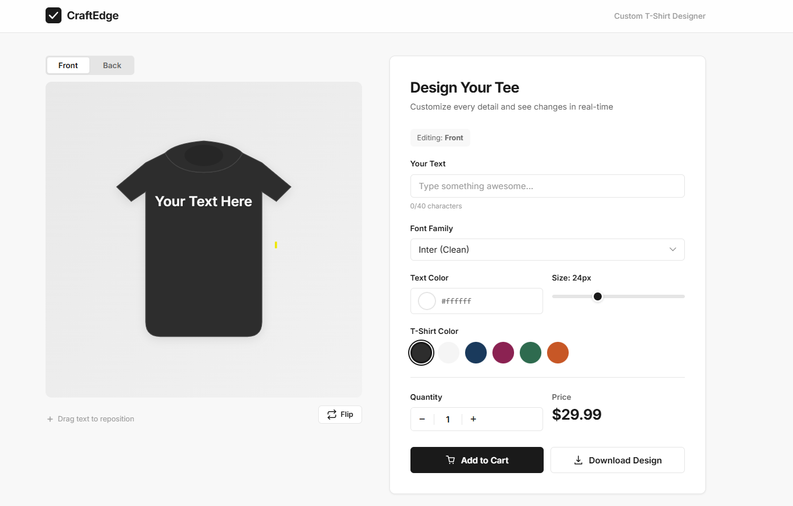
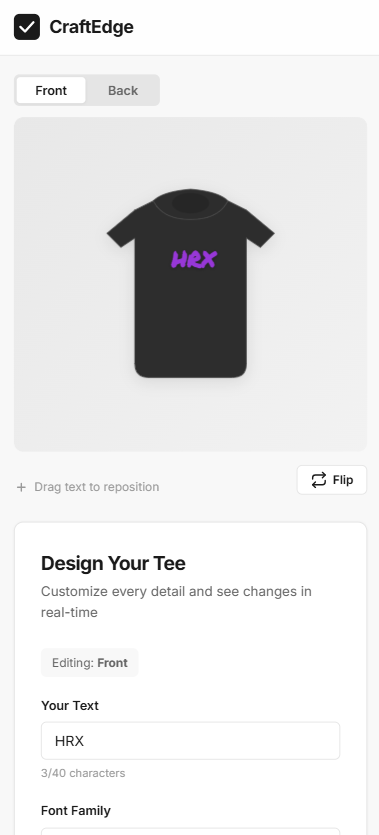

# 👕 CraftEdge — Custom T-Shirt Designer

A responsive product page where users can design custom t-shirts with **live text preview**, font/color customization, drag-to-reposition, and one-click PNG export — built entirely with vanilla HTML, CSS, and JavaScript. **Zero dependencies.**

> Built as a frontend development task submission for **CraftEdge Solutions**.

---

## 🔗 Live Demo

Open `index.html` directly in any modern browser — no server, no build step, no installs.

**Or visit:** (https://craft-edge.praveen-a3b.workers.dev/)

---

## 📸 Screenshots

| Desktop | Mobile |
|---------|--------|
|  |  |

---

## ✨ Features

| Feature | Description |
|---------|-------------|
| **Live Text Preview** | Text appears on the t-shirt instantly as you type |
| **Font Selector** | 5 curated Google Fonts — Inter, Playfair Display, Bebas Neue, Permanent Marker, Orbitron |
| **Text Color Picker** | Full RGB/hex color picker via native browser input |
| **Font Size Slider** | Adjustable from 12px to 48px with real-time preview |
| **T-Shirt Color Switcher** | 6 shirt colors — Black, White, Navy, Maroon, Forest Green, Burnt Orange |
| **Drag to Reposition** | Click and drag the text anywhere on the shirt preview |
| **Quantity & Pricing** | Quantity picker with auto-calculated price ($29.99/unit) |
| **Download as PNG** | Export your design at 2× resolution for print-ready quality |
| **Responsive Design** | Fully responsive — desktop, tablet, and mobile (320px+) |
| **Accessible** | ARIA labels, focus-visible states, keyboard navigation support |
| **Smart UX** | Auto-switches text to dark color when white shirt is selected |

---

## 🛠️ Tech Stack

| Technology | Purpose |
|------------|---------|
| **HTML5** | Semantic markup, accessibility |
| **CSS3** | Custom properties, Grid, Flexbox, transitions, animations |
| **Vanilla JavaScript (ES6+)** | DOM manipulation, Canvas API, Pointer Events |
| **SVG** | Scalable t-shirt mockup (no image files) |
| **Google Fonts** | Typography (Inter, Playfair Display, Bebas Neue, Permanent Marker, Orbitron) |

**No frameworks. No build tools. No npm. No dependencies.**

---

## 📁 Project Structure

```
craftedge-solution/
├── index.html          # Main product page
├── css/
│   └── style.css       # All styles (responsive, animations)
├── js/
│   └── app.js          # All interactivity and logic
├── screenshots/        # Screenshots for README 
└── README.md           # This file
```

---

## 🚀 Getting Started

### Option 1 — Open directly
```
Just double-click index.html
```

### Option 2 — Local server (optional)
```bash
# Python
python -m http.server 8000

# Node
npx serve .

# VS Code
# Install "Live Server" extension → Right-click index.html → Open with Live Server
```

Then open `http://localhost:8000` in your browser.

---

## 🎨 Design Decisions

- **SVG T-Shirt Mockup** — No raster images. The shirt is drawn with SVG paths, making it resolution-independent and trivially color-swappable via CSS custom properties.
- **CSS Custom Properties** — Shirt color, stroke, and shadow are controlled via `--shirt-color`, `--shirt-stroke`, and `--collar-shadow` — changed dynamically from JavaScript.
- **Pointer Events API** — Used for drag-to-reposition, which works uniformly across mouse and touch devices.
- **Canvas API for Export** — The download feature re-renders the SVG + text onto a `<canvas>` at 2× resolution, then exports as PNG.
- **Mobile-First Responsive** — Base styles target small screens; `min-width` media queries progressively enhance for larger viewports.

---

## 📋 Browser Support

| Browser | Supported |
|---------|-----------|
| Chrome 90+ | ✅ |
| Firefox 90+ | ✅ |
| Safari 15+ | ✅ |
| Edge 90+ | ✅ |
| Mobile Chrome/Safari | ✅ |

---

## 📝 Task Requirements & Completion

| Requirement | Status |
|-------------|--------|
| User can add text | ✅ Text input with 40-char limit |
| Preview updates live | ✅ Real-time on every keystroke |
| Basic UI (clean design) | ✅ Minimal, modern design with animations |
| Responsive | ✅ Desktop, tablet, mobile |
| Any tech stack | ✅ Zero-dependency vanilla stack |

**Extras delivered:** Font selection, color pickers, size slider, shirt color switcher, drag-to-reposition, quantity/pricing, PNG download, accessibility, toast notifications.

---

## 👤 Author

**Praveen** — [GitHub](https://github.com/praveen93h/)

---

## 📄 License

This project was built as a task submission. Feel free to reference for learning purposes.
